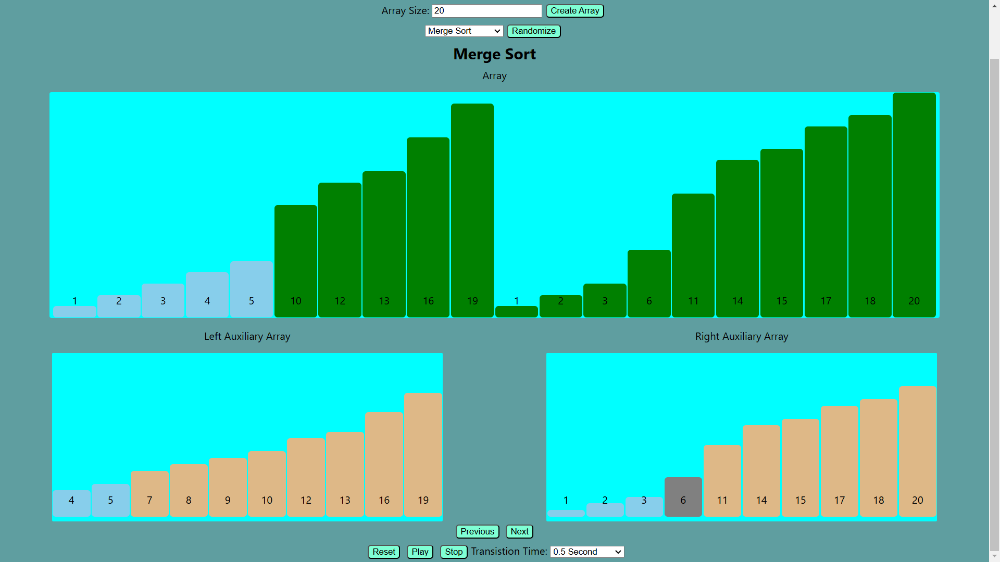

# Sorting Visualizer

A dynamic and interactive web application that visualizes various sorting algorithms, with a special emphasis on simulating **Merge Sort** like never before.

---

## Motivation

I was inspired to build a **Merge Sort simulation** that showcases its **non-in-place nature** using auxiliary arrays, something missing from existing visualizers. This project not only offers a unique, detailed view of Merge Sort but also covers other foundational algorithms for a comprehensive learning experience.

---

## Features

### **Comprehensive Sorting Algorithms**
- **Merge Sort**: Visualize the auxiliary arrays and merging process step-by-step.
- **Bubble Sort**: Observe elements "bubble" into their correct positions.
- **Selection Sort**: Watch how the smallest element is selected and placed.
- **Insertion Sort**: See how elements are inserted into their correct positions.
- **Quick Sort**: Understand partitioning and recursive sorting.

### **Interactive Features**
Gain **complete control** over the sorting process with the following interactive features:
- **Array Customization**:
  - Adjust the array size and generate arrays with the click of a button.
  - Randomize array values to test algorithms with different inputs.
- **Visualization Controls**:
  - **Play**: Automatically visualize the sorting process step by step.
  - **Pause**: Stop the animation at any point.
  - **Next**: Step through each sorting iteration manually.
  - **Previous**: Go back to previous iterations to review the process.
  - **Reset**: Return the array to its original unsorted state.
- **Display Options**:
  - Toggle the display of indexes and numbers on the bars for a cleaner or more detailed view.
- **Animation Speed**:
  - Adjust the **transition time** between iterations using a dropdown menu for fast-paced or detailed observation.
- **Merge Sort-Specific Views**:
  - Display **left** and **right auxiliary arrays** during merge operations for an in-depth understanding of the algorithm.

---

## Technologies Used

- **React**: For building a dynamic and responsive user interface.
- **CSS**: For animations and styling.
- **JavaScript**: For implementing sorting algorithms and managing state.

---

## Getting Started

### Prerequisites

- [Node.js](https://nodejs.org) installed on your machine.
- A package manager like `npm` or `yarn`.

### Installation

1. Clone this repository:
   ```bash
   git clone https://github.com/DheerajGedupudi/sorting-visualizer.git
   cd sorting-visualizer
   ```

2. Install dependencies:
   ```bash
   npm install
   ```

### Running the Project

Start the development server:

```bash
npm start
```

Visit [http://localhost:3000](http://localhost:3000) to view the app in your browser.

---

## How to Use

1. **Select an Algorithm**:
   - Choose a sorting algorithm (e.g., Merge Sort) from the dropdown menu.

2. **Customize the Array**:
   - Adjust the array size using the input box and click "Create Array."
   - Use the "Randomize" button to shuffle array values.

3. **Control the Sorting Process**:
   - **Play**: Automatically visualize the sorting process.
   - **Pause**: Stop the animation at any time.
   - **Next**: Step through each iteration of the sorting process manually.
   - **Previous**: Go back to previous iterations.
   - **Reset**: Reset the array to its initial unsorted state.

4. **Toggle Auxiliary Visualizations (Merge Sort)**:
   - Observe the **left** and **right auxiliary arrays** during each merge operation.

5. **Adjust Visualization Settings**:
   - Use checkboxes to show or hide indexes and numbers on the bars.
   - Adjust animation speed with the "Transition Time" dropdown menu.

---

## Screenshots

Here’s a snapshot of the **Merge Sort visualization**, highlighting its unique auxiliary array feature:



- **Main Array**: Displays the current progress of sorting.
- **Left and Right Auxiliary Arrays**: Show intermediate steps of the merging process.
- **Interactive Controls**: Provide complete control over the visualization, including animation speed adjustments.

---

## Why This Project Stands Out

- **Unique Merge Sort Visualization**:
  - Highlights the non-in-place nature of Merge Sort using auxiliary arrays, which is often overlooked in other visualizers.
- **Highly Interactive**:
  - Provides users with full control, allowing them to play, pause, reset, and step through sorting iterations at their own pace.
- **Comprehensive Algorithm Coverage**:
  - Covers key sorting algorithms like Bubble Sort, Selection Sort, Insertion Sort, Quick Sort, and Merge Sort, making it a valuable learning tool.
